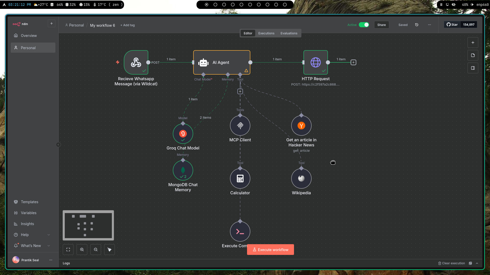

# Wildcat — WhatsApp Business API Integration

[](https://coderabbit.ai)

> **Unofficial WhatsApp integration** using reverse-engineered libraries. Use at your own risk and ensure compliance with WhatsApp's terms of service.

**Wildcat** is a Node.js API server that provides REST endpoints for WhatsApp messaging, media handling, and webhook delivery. Built with Baileys and MongoDB for reliable multi-account support.

## ✨ Why Wildcat?

**Advantages:**
- 🚀 **Multi-Account Support** - Manage multiple WhatsApp numbers simultaneously
- 📱 **Full WhatsApp Features** - Send/receive messages, media, reactions, and more
- 🔗 **Webhook Integration** - Real-time message delivery to external services
- 🧾 **Media Storage** - Automatic GridFS storage with direct access endpoints
- 🤖 **Bot-Ready** - Perfect for chatbots, automation, and CRM integrations
- ⚡ **REST API** - Clean HTTP interface for easy integration

**Shortcomings:**
- ⚠️ **Unofficial** - Relies on reverse-engineered WhatsApp protocols
- 🚫 **Rate Limited** - Subject to WhatsApp's sending limits
- 🔒 **No Official Support** - Community-maintained, no guarantees
- 📵 **Ban Risk** - Automated usage may trigger WhatsApp bans

## 🚀 Quick Start

```bash
# Install
npm install

# Configure
cp .env.example .env  # Edit with your settings

# Run
npm start

# Create account
curl -X POST http://localhost:3000/accounts \
  -H 'Content-Type: application/json' \
  -d '{"id": "myaccount", "name": "My Account"}'

# Scan QR code and start messaging!
```

## 📚 Documentation

- **[Setup Guide](./docs/SETUP.md)** - Installation & configuration
- **[API Reference](./docs/API_Reference.md)** - Complete endpoint documentation
- **[Architecture](./docs/ARCHITECTURE.md)** - System design
- **[Development](./docs/DEVELOPMENT.md)** - Contributing guide

## 🧰 CLI Tools

```bash
npm run accounts     # List accounts
npm run account:create mybot "Bot Account"
npm run message:send mybot 1234567890@s.whatsapp.net "Hello!"
```

## 🐳 Docker

A minimal image is provided via the `Dockerfile` with ffmpeg installed for audio conversion.

- Build the image:
```bash
docker build -t wildcat:latest .
```

- Run the container (connect to MongoDB and expose port 3000):
```bash
docker run --name wildcat \
  -p 3000:3000 \
  -e HOST=0.0.0.0 \
  -e PORT=3000 \
  -e MONGO_URL="mongodb://host.docker.internal:27017" \
  -e DB_NAME=wildcat \
  -e AUTO_CONNECT_ON_START=true \
  wildcat:latest
```

- Using a Docker network with MongoDB:
```bash
# Example: run mongo separately
docker network create wildcat-net || true
docker run -d --name mongo --network wildcat-net -p 27017:27017 mongo:6

# Run Wildcat on the same network
docker run --name wildcat --network wildcat-net -p 3000:3000 \
  -e MONGO_URL="mongodb://mongo:27017" \
  -e DB_NAME=wildcat \
  -e AUTO_CONNECT_ON_START=true \
  wildcat:latest
```

Environment variables:
- `HOST` (default `0.0.0.0`)
- `PORT` (default `3000`)
- `MONGO_URL` (e.g., `mongodb://mongo:27017`)
- `DB_NAME` (e.g., `wildcat`)
- `ADMIN_NUMBER` (optional: `jid@s.whatsapp.net` to receive a startup ping)
- `AUTO_CONNECT_ON_START` (`true|false`) to auto-connect restored accounts

Health check: `GET /ping`

## 🔀 n8n Integration (Example)

The screenshot below demonstrates integrating Wildcat with n8n to receive webhooks and send WhatsApp messages via the REST API.



Basic flow:
- Receive inbound message via Wildcat webhook at your n8n HTTP Trigger node.
- Transform or route the payload in n8n.
- Send an outbound WhatsApp message using an HTTP Request node:
  - Method: `POST`
  - URL: `http://<wildcat-host>:3000/accounts/<accountId>/message/send`
  - Body (JSON): `{ "to": "1234567890@s.whatsapp.net", "message": "Hello from n8n!" }`

Register the webhook URL in Wildcat:
```bash
curl -X POST http://<wildcat-host>:3000/webhooks \
  -H 'Content-Type: application/json' \
  -d '{"url":"https://your-n8n-host/webhook/<id>"}'
```

For more examples, see `docs/API_Reference.md`.

## 🤝 Contributing

See [Development Guide](./docs/DEVELOPMENT.md) for contribution guidelines.

## 🙏 Acknowledgments

This project builds upon the work of many open-source contributors. See [ACKNOWLEDGMENTS.md](./ACKNOWLEDGMENTS.md) for a complete list of third-party projects and libraries used, including:

- **@whiskeysockets/baileys** - WhatsApp Web API implementation
- **mongo-baileys** - MongoDB session persistence (adapted code in `mongoAuthState.js`)
- **Express**, **MongoDB**, and many other excellent npm packages

## 📄 License

GPL-3.0-only — See `LICENSE`

This project includes adapted code from MIT-licensed dependencies, which is compatible with GPL-3.0. All original copyright notices and attributions are preserved in the respective files and documented in `ACKNOWLEDGMENTS.md`.

---

**Repository:** https://github.com/NotoriousArnav/wildcat

## 🤖 CodeRabbit Setup

- Install the CodeRabbit GitHub App and grant access to this repo
- Ensure this config file exists: `.coderabbit.yml` at repo root
- Open a PR; CodeRabbit will auto-review and comment
- Optional: Require the CodeRabbit status check in branch protection

